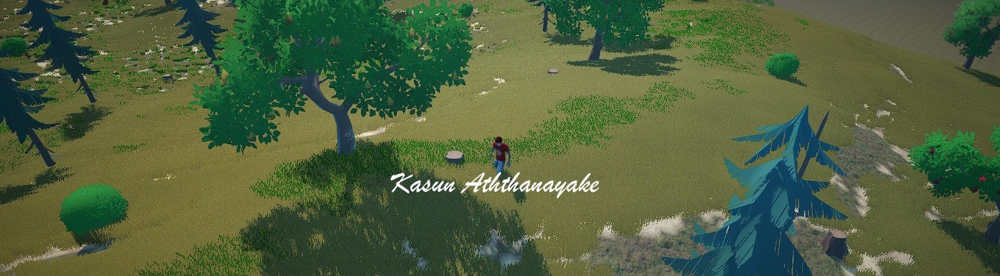

# Hi, I am Kasun (KAZ) 👋

I'm a tech enthusiast who would like to explore new technologies, not just programming languages but also devices.
I love to share knowledge with the rest of the world, and that's why make YouTube videos.
Since I'm (still) a full-time Software Engineer, I also like to share my code so others can make use of them.

### Top technologies

### My stats (Public repos only)

### My Contributions

[Flutter - UI Tool](https://pub.dev/packages/ui_tool)

